# **Deploying RAG on K8s with Jenkins for Legal Document Retrieval** 
- [**Deploying RAG on K8s with Jenkins for Legal Document Retrieval**](#deploying-rag-on-k8s-with-jenkins-for-legal-document-retrieval)
  - [I. Overview](#i-overview)
  - [II. Create GKE Cluster using Terraform](#ii-create-gke-cluster-using-terraform)
  - [III. Deploy serving service manually](#iii-deploy-serving-service-manually)
      - [1. Deploy NGINX ingress controller](#1-deploy-nginx-ingress-controller)
      - [2. Deploy the Embedding Model](#2-deploy-the-embedding-model)
      - [3. Deploy the Vector Database](#3-deploy-the-vector-database)
      - [4. Deploy the RAG Controller](#4-deploy-the-rag-controller)
      - [5. Deploy the Indexing Pipeline](#5-deploy-the-indexing-pipeline)
      - [6. Deploy the LLM](#6-deploy-the-llm)
      - [7. Deploy the Data Preprocessing Pipeline](#7-deploy-the-data-preprocessing-pipeline)
  - [IV. Deploy observable service](#iv-deploy-observable-service)
      - [1. Tracing with Jaeger \& Opentelemetry](#1-tracing-with-jaeger--opentelemetry)
      - [2. Monitoring with Loki and Prometheus, then deploy dashboard in Grafana](#2-monitoring-with-loki-and-prometheus-then-deploy-dashboard-in-grafana)
  - [V. Create GCE Cluster using Ansible](#v-create-gce-cluster-using-ansible)
  - [VI. Setup Jenkins](#vi-setup-jenkins)
      - [1 Connecting with K8s cluster](#1-connecting-with-k8s-cluster)
      - [2 Add Docker Hub's credentials](#2-add-docker-hubs-credentials)
      - [3 Config Github API usage rate limiting strategy](#3-config-github-api-usage-rate-limiting-strategy)
      - [4 Create Item and Connect Jenkins to GitHub](#4-create-item-and-connect-jenkins-to-github)
      - [5 Set Up a GitHub Webhook to Automatically Deploy on Code Push](#5-set-up-a-github-webhook-to-automatically-deploy-on-code-push)
  - [VII. Demo](#vii-demo)
      - [1 Demo Process Ingest Data](#1-demo-process-ingest-data)
      - [2 Demo Process Query](#2-demo-process-query)


## I. Overview
Retrieval-augmented generation (RAG) systems combine generative AI with information retrieval to provide contextualized answer generation. Building reliable and performant RAG applications at scale is challenging. In this project, I deploy a continuous and highly scalable RAG application on Google Kubernetes Engine (GKE) using CI/CD. This is my first project as a Machine Learning Engineer (MLE), and I learned from [FSDS](https://fullstackdatascience.com/). The image below shows my overall system architecture:
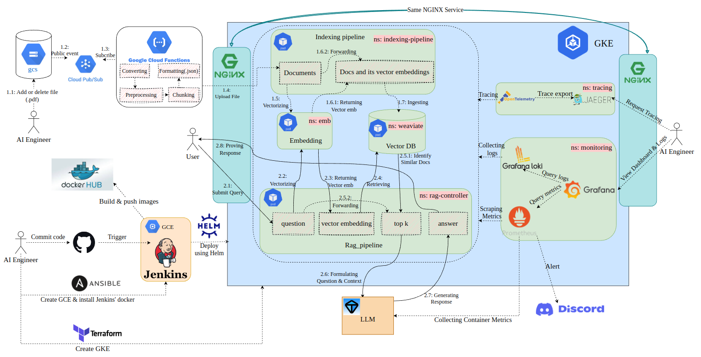

**Technology utilized**
* Source control: Git/Github
* CI/CD: Jenkins
* Build API: FastAPI
* Containerize application: Docker
* Container orchestration system: Kubernetes (K8s)
* K8s's package manager: Helm
* Data Storage for pdf: Google Cloud Storage
* Data Storage for vector embedding: Weaviate
* Event trigger: Cloud Pub/Sub
* Serverless functions response events: Google Cloud Functions
* Ingress controller: Nginx ingress
* Observable tools: Prometheus, Loki, Grafana, Jaeger
* Deliver infrastructure as code: Ansible & Terraform
* Cloud platform: Google Cloud Platform (GCP)
* Embedding model: [Vietnamese Embedding Model](https://huggingface.co/dangvantuan/vietnamese-embedding)
* Large language model: [Mistral-7B-v0.1](https://huggingface.co/mistralai/Mistral-7B-v0.1)
* Data Source: [Government Documents (PDF)](https://congbao.chinhphu.vn/tai-ve-van-ban-so-08-vbhn-vpqh-40454-47126?format=pdf)

**Project Structure**

- **ansible/**: Creates GCE instances and downloads a custom Docker image for Jenkins.
- **custom_image_jenkins/**: Custom Jenkins image that includes the Helm tool.
- **data_pipeline/**: Set up a system to automatically handle data that is uploaded to or deleted from a GCS bucket.
  - **.pdf**: Data to import.
  - **main.py**: Serves as the entry point for a function or a set of functions that perform specific tasks related to data preprocessing.
- **embedding/**: Deploys the embedding model.
  - **helm_embedding/**: Helm chart for deploying the embedding model.
  - **app.py**: API for the embedding model.
  - **Dockerfile**: Dockerfile for the embedding model.
- **image/**: Contains images displayed in `README.md`.
- **indexing_pipeline/**: Deploys the indexing pipeline.
  - **helm_indexing_pipeline/**: Helm chart for deploying the indexing pipeline.
  - **main.py**: API and communication handler for the indexing pipeline.
  - **Dockerfile**: Dockerfile for the indexing pipeline.
- **jaeger-all-in-one/**: Helm chart for deploying Jaeger.
- **loki/**: Helm chart for deploying Loki.
- **nginx-ingress/**: Helm chart for deploying Nginx Ingress.
- **prometheus1/**:
  - **kube-prometheus-stack/**: Helm chart for deploying monitoring tools like Prometheus, Alertmanager, and Grafana.
  - **values-prometheus.yaml**: Custom values for the `kube-prometheus-stack` chart.
  - **tgi_dashboard.json**: Grafana dashboard to display metrics for the LLM container.
- **rag_controller1/**: Deploys the RAG controller.
  - **helm_rag_controller/**: Helm chart for deploying the RAG controller.
  - **main.py**: API and communication handler for the RAG controller.
  - **Dockerfile**: Dockerfile for the RAG controller.
- **terraform/**: Terraform scripts for creating the GKE cluster.
- **weaviate/**: Helm chart for deploying the Weaviate vector database.
- **notebook.ipynb**: Jupyter notebook for testing components of the RAG system such as the embedding model, vector database, and LLM.
- **Jenkinsfile**: Defines the CI/CD pipeline for continuous deployment of `rag_controller1`.

```txt
  ├── ansible                                            /* Creates GCE instances and downloads a custom Docker image for Jenkins */
  ├── custom_image_jenkins                               /* Custom Jenkins image that includes the Helm tool */
  ├── data_pipeline                                      /* Set up a system to automatically handle data that is uploaded to or deleted from a GCS bucket */
  │    ├── .pdf                                          /* Data to import */
  │    └── main.py                                       /* Serves as the entry point for data preprocessing tasks */
  ├── embedding                                          /* Deploys the embedding model */
  │    ├── helm_embedding                                 /* Helm chart for deploying the embedding model */
  │    ├── app.py                                        /* API for the embedding model */
  │    └── Dockerfile                                    /* Dockerfile for the embedding model */
  ├── image                                              /* Contains images displayed in `README.md` */
  ├── indexing_pipeline                                  /* Deploys the indexing pipeline */
  │    ├── helm_indexing_pipeline                        /* Helm chart for deploying the indexing pipeline */
  │    ├── main.py                                       /* API and communication handler for the indexing pipeline */
  │    └── Dockerfile                                    /* Dockerfile for the indexing pipeline */
  ├── jaeger-all-in-one                                  /* Helm chart for deploying Jaeger */
  ├── loki                                               /* Helm chart for deploying Loki */
  ├── nginx-ingress                                      /* Helm chart for deploying Nginx Ingress */
  ├── prometheus1                                        /* Contains monitoring tools deployment configurations */
  │    ├── kube-prometheus-stack                         /* Helm chart for deploying Prometheus, Alertmanager, and Grafana */
  │    ├── values-prometheus.yaml                        /* Custom values for the `kube-prometheus-stack` chart */
  │    └── tgi_dashboard.json                            /* Grafana dashboard to display metrics for the LLM container */
  ├── rag_controller1                                    /* Deploys the RAG controller */
  │    ├── helm_rag_controller                           /* Helm chart for deploying the RAG controller */
  │    ├── main.py                                       /* API and communication handler for the RAG controller */
  │    └── Dockerfile                                    /* Dockerfile for the RAG controller */
  ├── terraform                                          /* Terraform scripts for creating the GKE cluster */
  ├── weaviate                                           /* Helm chart for deploying the Weaviate vector database */
  ├── notebook.ipynb                                     /* Jupyter notebook for testing components of the RAG system */
  └── Jenkinsfile                                        /* Defines the CI/CD pipeline for continuous deployment of `rag_controller1` */

```

## II. Create GKE Cluster using Terraform
**1. Create Project in [Google Cloud Platform](https://console.cloud.google.com/) and Enable GKE Standard in [GKE](https://console.cloud.google.com/kubernetes).**

**2. Install gcloud CLI & google-cloud-cli-gke-gcloud-auth-plugin**
It can be installed following this document https://cloud.google.com/sdk/docs/install#deb
```bash
gcloud auth application-default login
```
**3. Enables the Google Kubernetes Engine (GKE) API and sets the default project**
```bash
gcloud services enable container.googleapis.com --project=<your_project_id>
gcloud config set project <your_project_id>
```
**4. Using terraform to create GKE cluster**

Update <your_project_id> in terraform/variables.tf  and run the following commands to create GKE cluster:
```bash
cd terraform
terraform init
terraform plan
terraform apply
```
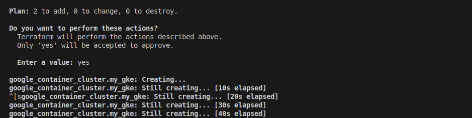
+ GKE cluster is deployed at **asia-southeast1** with its one node machine type is: **"e2-standard-4"**  (4 vCPUs, 16 GB RAM and costs $396.51/month).
+ Unable [Autopilot](https://cloud.google.com/kubernetes-engine/docs/concepts/autopilot-overview) for the GKE cluster. When using Autopilot cluster, certain features of Standard GKE are not available, such as scraping node metrics from Prometheus service.

It can takes about 10 minutes for create successfully a GKE cluster. You can see that on [GKE UI](https://console.cloud.google.com/kubernetes/list)
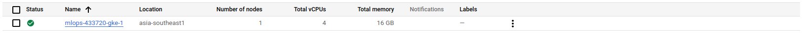
**5. Connect to the GKE cluster**
+ In the [GKE UI](https://console.cloud.google.com/kubernetes/list) you follow instruction gif below to connect GKE cluster:
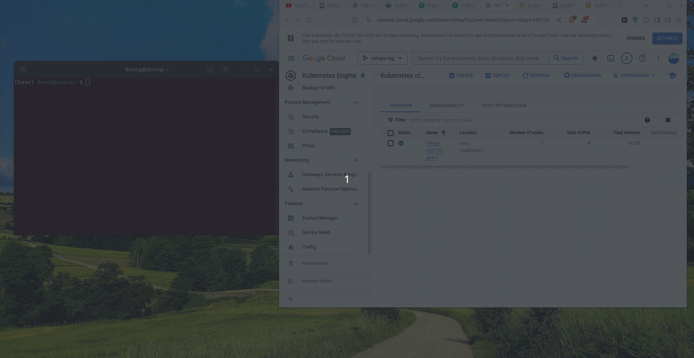

## III. Deploy serving service manually
Use the [Helm chart](https://helm.sh/docs/topics/charts/) to deploy application on GKE cluster.
#### 1. Deploy NGINX ingress controller
Using NGINX on Kubernetes is a common pattern for managing and routing traffic within a Kubernetes cluster, particularly when dealing with external traffic. Instead of assigning multiple external IPs to different services, using an NGINX ingress controller offers several benefits, including efficient traffic management, cost reduction, and a simplified architecture. You can run the following bash command to deploy NGINX on Kubernetes:
```bash
helm upgrade --install nginx-ingress ./nginx-ingress --namespace nginx-system --create-namespace
```
After executing this command, the NGINX ingress controller will be created in the nginx-system namespace. Then, copy the external-ip of its service to use in the following steps.
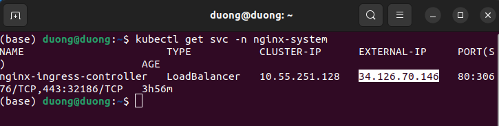

#### 2. Deploy the Embedding Model
Since my data pertains to Vietnam's law, I use an embedding model that is trained specifically for Vietnamese words. Run the following bash command to deploy it on Kubernetes:
```bash
helm upgrade --install text-vectorizer ./embedding/helm_embedding --namespace emb --create-namespace
```
After executing this command, several pods for the embedding model will be created in the `emb` namespace.

#### 3. Deploy the Vector Database
To deploy the vector database, run the following bash command:
```bash
helm upgrade --install   "weaviate"   ./weaviate   --namespace "weaviate"   --values ./weaviate/values.yaml --create-namespace
```
After this command, a pod for the vector database will be created in the `weaviate` namespace.

#### 4. Deploy the RAG Controller
This component coordinates user queries and provides answers from the LLM. Before running the Helm install command, you must edit the host of the ingress in `./rag_controller1/helm_rag_controller/values.yaml`, to use the `external-ip` of the NGINX service mentioned above and append `sslip.io` to expose the IP publicly. For example, in my case:
```helm
ingress: 
  host: 34.126.70.146.sslip.io
```
Then, run the following bash command to deploy it on Kubernetes:
```bash
helm upgrade --install   rag-controller   ./rag_controller1/helm_rag_controller   --namespace "rag-controller" --create-namespace
```
Now you can access Rag Controller at address: http://34.126.70.146.sslip.io/rag/docs
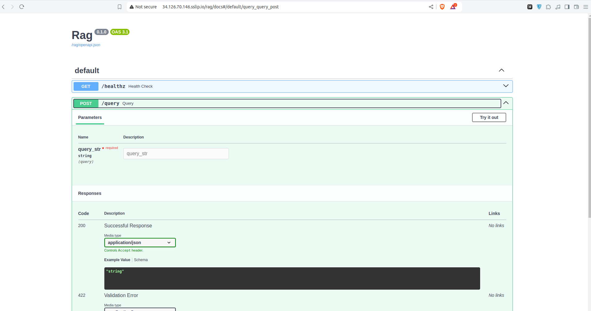

#### 5. Deploy the Indexing Pipeline
This component manages data indexing to the vector database. Similar to the RAG controller, you need to edit the host of the ingress in `./indexing_pipeline/helm_indexing_pipeline/values.yaml`, using the `external-ip` of the NGINX service mentioned earlier and appending `nip.io` to expose the IP publicly. For example, in my case:
```helm
ingress: 
  host: 34.126.70.146.nip.io
```
Then, run the following bash command to deploy it on Kubernetes:
```bash
helm upgrade --install indexing-pipeline ./indexing_pipeline/helm_indexing_pipeline --namespace indexing-pipeline --create-namespace
```
Now you can access Indexing Pipeline at address: http://34.126.70.146.nip.io/idx/docs
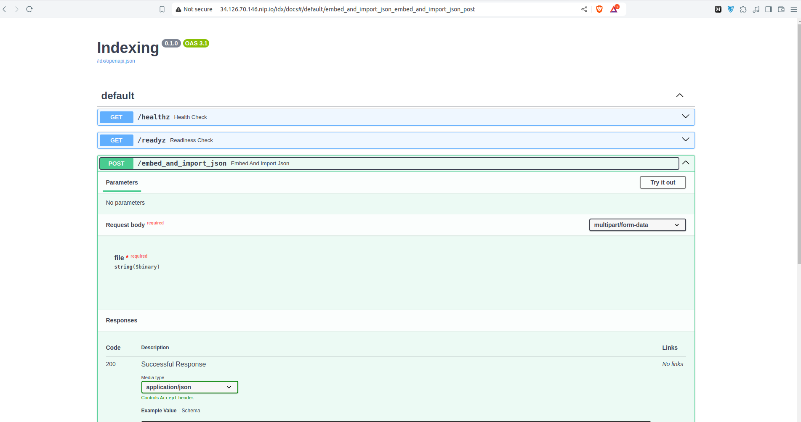
#### 6. Deploy the LLM
Since I'm using the free version of Google Cloud, it doesn't support GPUs. Therefore, I deploy the LLM locally based on Hugging Face's `text generation inference`. To deploy this model, I use a GPU with 24GB VRAM:
```bash
sudo docker run --gpus all --shm-size 64g -p 8080:80 -v ./data:/data \
    --env HUGGING_FACE_HUB_TOKEN=<your_token> \
    ghcr.io/huggingface/text-generation-inference:2.2.0 \
    --model-id Viet-Mistral/Vistral-7B-Chat
```
After running the container, I expose the local web service to the internet via the [pagekite](https://pagekite.net/) service: `https://nthaiduong23.pagekite.me/`, Please note that the free version of `pagekite` has a traffic quota of 2555 MB and is available for only one month, so it is suitable only for experimental purposes.


**How to get domain name using `pagekite`**

You should create an account email clone and login in to [pagekite](https://pagekite.net/)
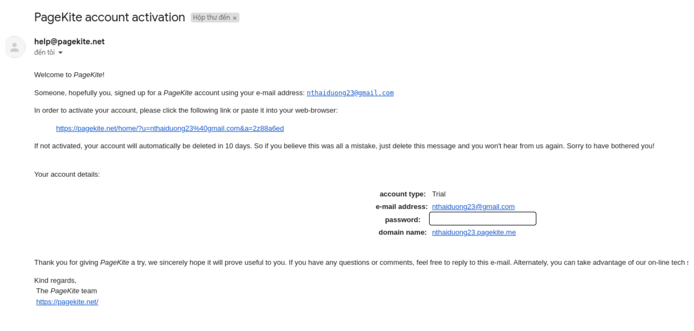
After clicking the link in the verification email, set up your secret key, such as `12345`. 
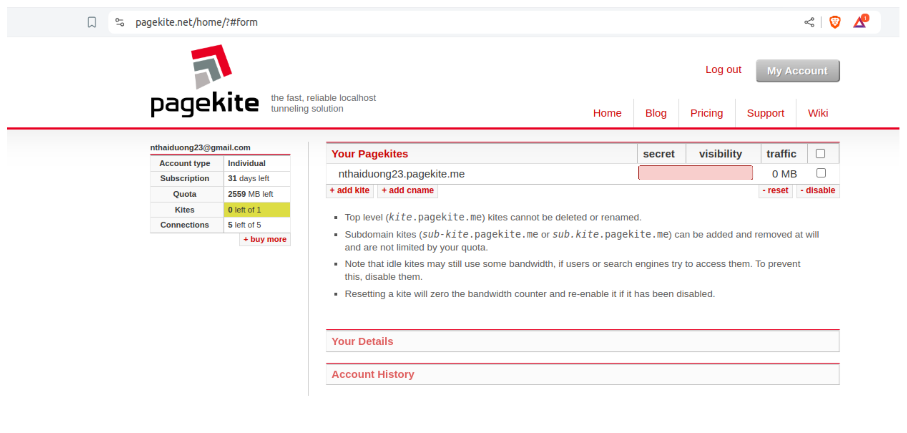
And edit `pagekite.rc` using:
```bash
nano ~/.pagekite.rc
```
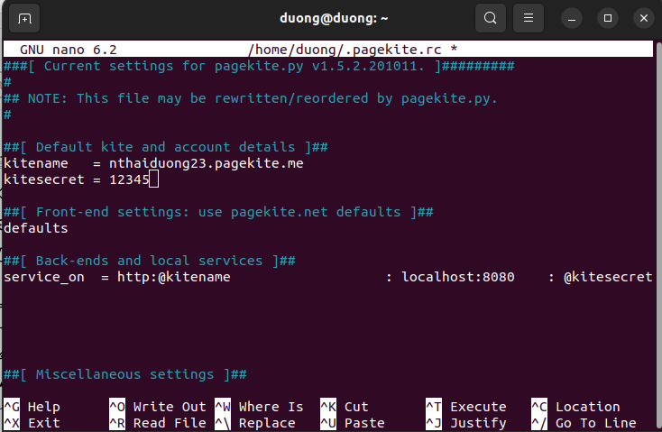

Then execute the following commands to create your domain name:
```bash
curl -O https://pagekite.net/pk/pagekite.py
python pagekite.py --fe_nocertcheck 8080 nthaiduong23.pagekite.me
```
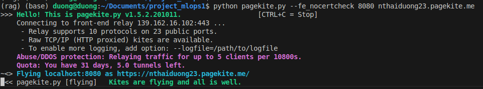
Now you can access LLM at address: https://nthaiduong23.pagekite.me/docs/
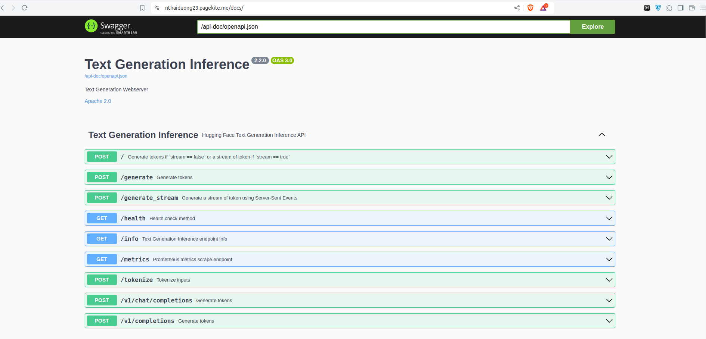

#### 7. Deploy the Data Preprocessing Pipeline
This section involves importing data from an external database into Weaviate. First, you should create two bucket in [GCS](https://console.cloud.google.com/storage/), one for store file pdf when Engineer post, one for store file json after process through [Google Cloud Run function]{https://console.cloud.google.com/functions/} and then add permission to the bucket: `storage admin`
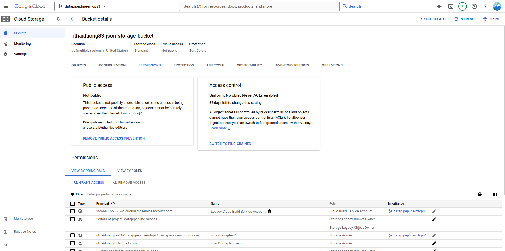
Next, enter the following commands to set up notifications and Pub/Sub subscriptions:
```bash
gsutil notification create -t pdf-upload-topic -f json gs://nthaiduong83-pdf-bucket1

gcloud pubsub subscriptions create pdf-upload-subscription --topic=pdf-upload-topic
```

Before creating Google Cloud Functions on Google Cloud Platform (GCP) to handle events related to a specific Google Cloud Storage (GCS) bucket, you must update the variable `api_url="http://<external_ip_svc_NGINX>.nip.io/embed_and_import_json"` in `./data_pipeline/main.py` for importing into the `indexing-pipeline` on K8s. In my case, it is `api_url = "http://34.126.70.146.nip.io/embed_and_import_json"`:
```bash
cd data_pipeline

gcloud functions deploy process-pdf-file \
--runtime python310 \
--trigger-topic pdf-upload-topic \
--entry-point process_pdf_file \
--timeout 540s \
--memory 512MB

gcloud functions deploy handle-pdf-delete \
--runtime python310 \
--trigger-event google.storage.object.delete \
--trigger-resource nthaiduong83-pdf-bucket1 \
--entry-point handle_pdf_delete \
--timeout 540s \
--memory 512MB
```
To import a PDF into the bucket, use the following command:
```bash
gsutil cp <your_pdf_path> gs://nthaiduong83-pdf-bucket1/
```
To remove it, use:
```bash
gsutil rm gs://nthaiduong83-pdf-bucket1/gt1.pdf
```
This setup allows you to automate the handling of file uploads and deletions in the GCS bucket, triggering specific functions to process these events as needed.

## IV. Deploy observable service
#### 1. Tracing with Jaeger & Opentelemetry
Before deployment, edit the `ingress.host` variable to match your Jaeger domain, like so:  `ingress.host=<your_domain_jaeger>`. In my case, it is `ingress.host=jaeger.ntd.com`

Then, run the following command to deploy Jaeger on Kubernetes:
```bash
helm upgrade --install jaeger-tracing ./jaeger-all-in-one --namespace jaeger-tracing --create-namespace
```

Next, add Jaeger's domain name to NGINX's external IP:
```bash
sudo vim /etc/hosts

<your_external_svc_nginx> <your_domain_jaeger>
```
For example, in my case:
```bash
sudo vim /ect/hosts

34.126.70.146 jaeger.ntd.com
```
Now you can access Jaeger UI at `http://<your_domain_jaeger>/search`

#### 2. Monitoring with Loki and Prometheus, then deploy dashboard in Grafana
Loki is used for collecting logs from Kubernetes, while Prometheus scrapes metrics from Kubernetes and the LLM’s container. Since Prometheus scrapes metrics from the LLM’s container locally, you need to add a job for it in `./prometheus1/values-prometheus.yaml`
```bash
prometheus:
  prometheusSpec:
    additionalScrapeConfigs:
      - job_name: 'tgi-public-metrics'
        scrape_interval: 30s
        metrics_path: /metrics
        scheme: https
        static_configs:
          - targets: ['nthaiduong23.pagekite.me']
```
Then, run the following commands to deploy Prometheus and Loki on Kubernetes:
```bash
helm upgrade --install prometheus-grafana-stack -f ./prometheus1/values-prometheus.yaml ./prometheus1/kube-prometheus-stack --namespace monitoring --create-namespace
```
```bash
helm upgrade --install loki -f ./loki/values-loki.yaml ./loki/loki-stack --namespace monitoring --create-namespace
```
Similar to Jaeger, edit `ingress.host=<your_domain_you_want>` and run the following command to add the domain name to NGINX's external IP. In my case:
```bash
sudo vim /etc/hosts

34.126.70.146 prometheus.ntd.com
34.126.70.146 grafana.ntd.com
```
Now you can access Prometheus UI and Grafana UI at `http://<your_domain_jaeger>/search`.
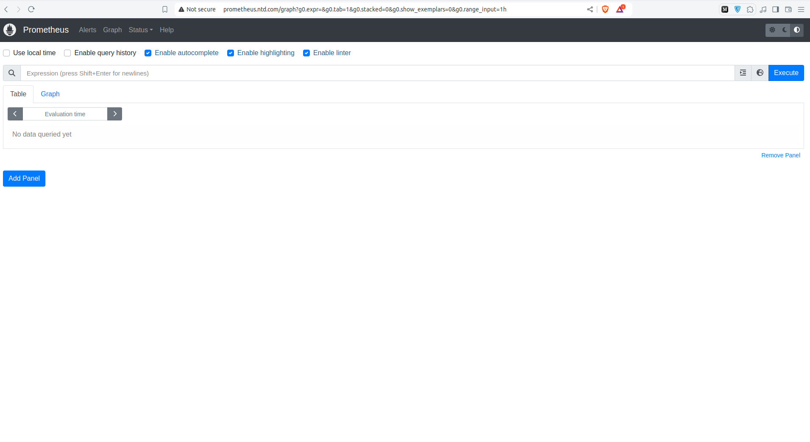
You should enter the username and password as shown in the image below: 
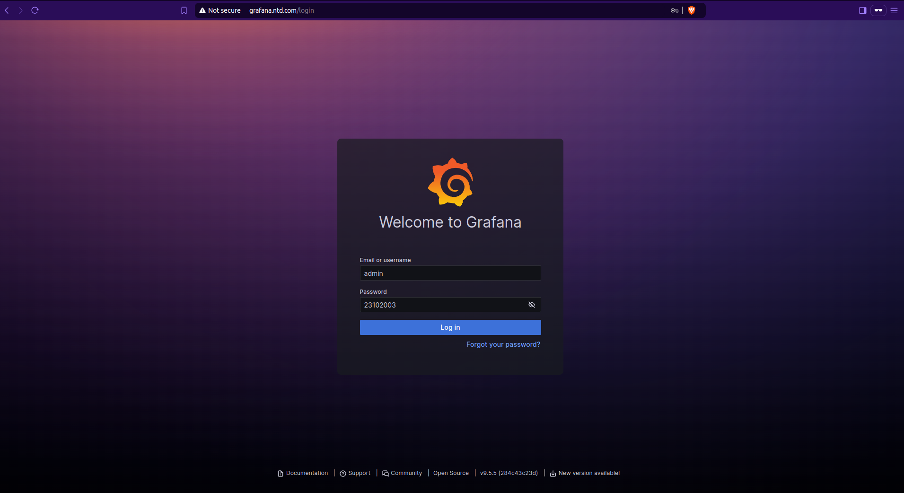
Then import `tgi_dashboard.json`  in the Grafana UI to display metrics for the LLM:
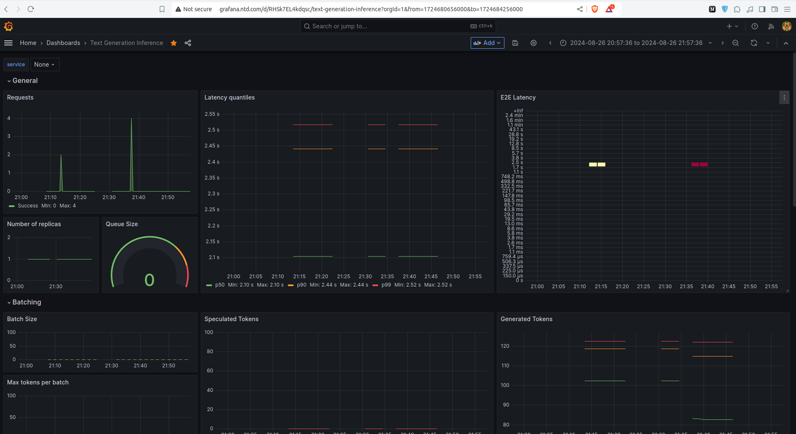
To display cluster metrics, navigate to `Dashboards/General`:
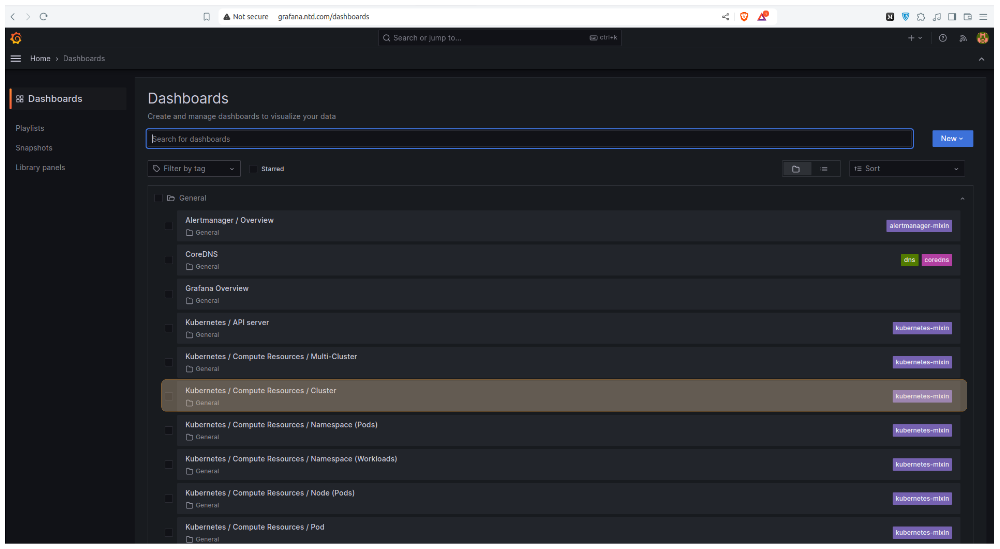
And this is the result:
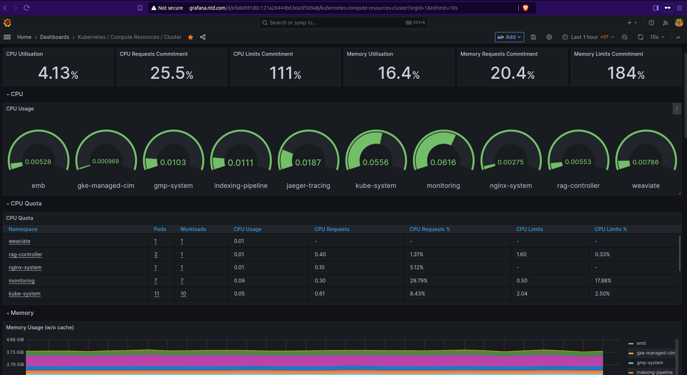

Also to view logs from Loki, follow the steps shown in the GIF below:


## V. Create GCE Cluster using Ansible
You can use the same project with GKE as long as you have enough `quota`, or you can create a new project. In this guide, I used the same project as above. Download the service account key in JSON format; instructions are below:

After obtaining the JSON key file, move it to the `ansible/secrets` folder and update the **service_account_file** and **project** variables in `ansible/playbooks/create_compute_instance.yaml`  corresponding with path secret file already and your project id, then run following command:
```bash
cd ansible

conda create -n ansible python==3.9 -y
pip install -r requirements.txt

ansible-playbook playbooks/create_compute_instance.yaml
```
+ GCE is deployed at **asia-southeast1-b** with machine type is: **"e2-standard-2"**  (2 vCPUs, 8 GB RAM and costs $49.92/month).

After creating the GKE cluster, copy the external IP of the VM and add it to the inventory. Also, update the SSH keys in the VM’s metadata, as shown below:
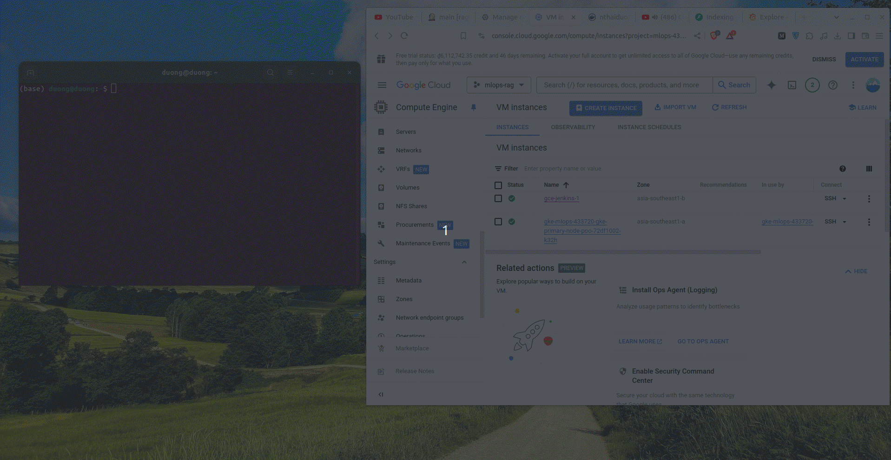

To install Jenkins on the VM, use a Dockerfile from `custom_image_jenkins` to build a Docker-based Jenkins that comes with Helm, enabling it to create agents to deploy pods in Kubernetes:
```bash
cd custom_image_jenkins

docker build -t <your_name_dockerhub>:<your_tag> .
docker push <your_name_dockerhub>:<your_tag>
```
Alternatively, you can use my Docker image: `nthaiduong83/jenkins-k8s:v1`
Then, run the following command to install Jenkins on the VM:

```bash
cd ansible

ansible-playbook -i inventory playbooks/deploy_jenkins.yaml
```
After completing these tasks, access the VM and check the Docker container.
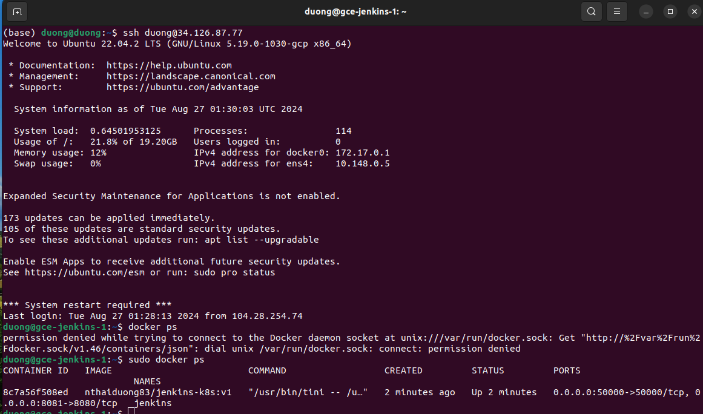

## VI. Setup Jenkins
Follow the instructions in the GIF below to set up Jenkins:
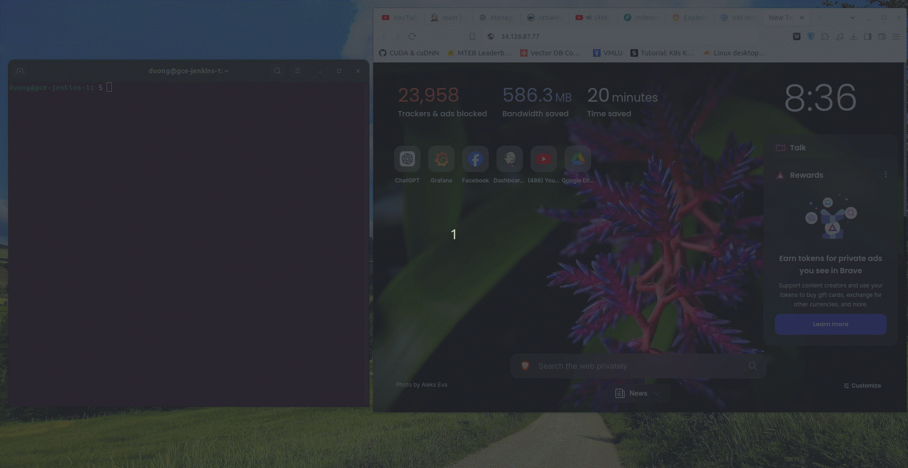
After the installation is complete, run the following commands:
```bash
kubectl create clusterrolebinding <your_name_space>-admin-binding \
  --clusterrole=admin \
  --serviceaccount=<your_name_space>:default \
  --namespace=<your_name_space>

kubectl create clusterrolebinding anonymous-admin-binding \
  --clusterrole=admin \
  --user=system:anonymous \
  --namespace=<your_name_space>
```
Install the following Kubernetes plugins in Jenkins: "Docker, Docker Pipeline, gcloud SDK, Kubernetes", as shown in this GIF:

Use the command `kubectl config view --raw` to view the cluster's certificate and URL.
#### 1 Connecting with K8s cluster
Create ClusterRoleBinding in you GKE instance:
```bash
kubectl create clusterrolebinding model-serving-admin-binding \
  --clusterrole=admin \
  --serviceaccount=default:default \
  --namespace=default

kubectl create clusterrolebinding anonymous-admin-binding \
  --clusterrole=admin \
  --user=system:anonymous \
  --namespace=default
```
And you follow the gif below:


#### 2 Add Docker Hub's credentials
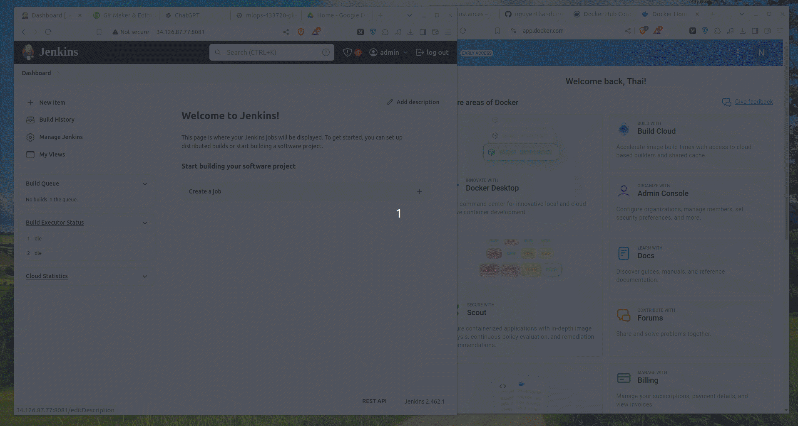

#### 3 Config Github API usage rate limiting strategy
Change strategy into: `Never check rate limie`
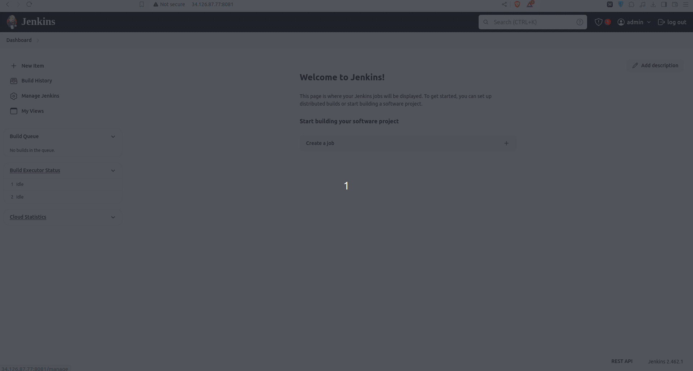

#### 4 Create Item and Connect Jenkins to GitHub

When the build is complete, you will see the following:
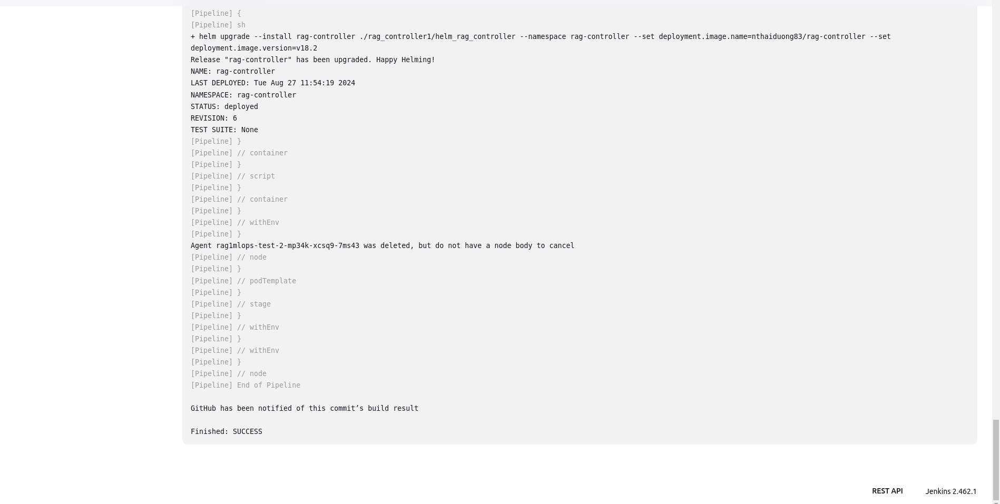

#### 5 Set Up a GitHub Webhook to Automatically Deploy on Code Push
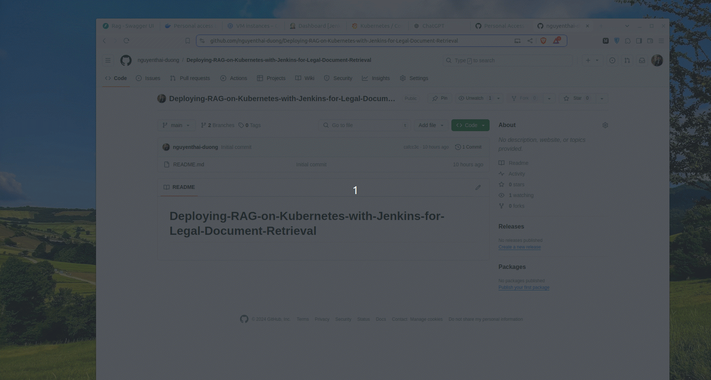

## VII. Demo
#### 1 Demo Process Ingest Data


#### 2 Demo Process Query
