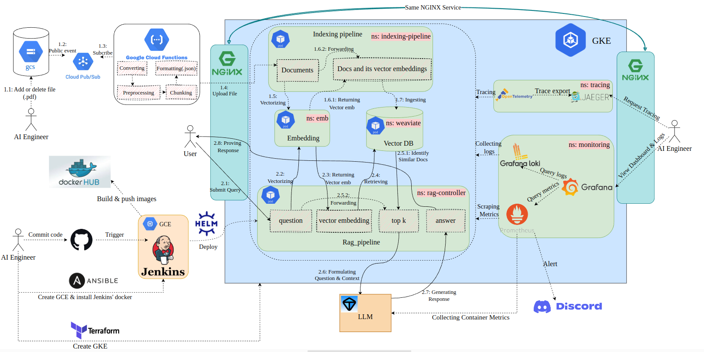

# **Deploying RAG Applications on K8s** 


## **1. Overview:**
Retrieval-augmented generation (RAG) systems combine generative AI with information retrieval to provide contextualized answer generation. Building reliable and performant RAG applications at scale is challenging. In this project, I deploy a continuous and highly scalable RAG application on Google Kubernetes Engine (GKE) using CI/CD. This is my first project as a Machine Learning Engineer (MLE), and I learned from [FSDS](https://fullstackdatascience.com/). The image below shows my overall system architecture:


**Technology utilized**
* Source control: Git/Github
* CI/CD: Jenkins
* Build API: FastAPI
* Containerize application: Docker
* Container orchestration system: Kubernetes (K8s)
* K8s's package manager: Helm
* Data Storage for pdf: Google Cloud Storage
* Data Storage for vector embedding: Weaviate
* Event trigger: Cloud Pub/Sub
* Serverless functions response events: Google Cloud Functions
* Ingress controller: Nginx ingress
* Observable tools: Prometheus, Loki, Grafana, Jaeger
* Deliver infrastructure as code: Ansible & Terraform
* Cloud platform: Google Cloud Platform (GCP)
* Embedding model: [Vietnamese Embedding Model](https://huggingface.co/dangvantuan/vietnamese-embedding)
* Large language model: [Mistral-7B-v0.1](https://huggingface.co/mistralai/Mistral-7B-v0.1)
* Data Source: [Government Documents (PDF)](https://congbao.chinhphu.vn/tai-ve-van-ban-so-08-vbhn-vpqh-40454-47126?format=pdf)

**Project Structure**

- **ansible/**: Creates GCE instances and downloads a custom Docker image for Jenkins.
- **custom_image_jenkins/**: Custom Jenkins image that includes the Helm tool.
- **data_pipeline/**: Set up a system to automatically handle data that is uploaded to or deleted from a GCS bucket.
  - **.pdf**: Data to import.
  - **main.py**: Serves as the entry point for a function or a set of functions that perform specific tasks related to data preprocessing.
- **embedding/**: Deploys the embedding model.
  - **helm_embedding/**: Helm chart for deploying the embedding model.
  - **app.py**: API for the embedding model.
  - **Dockerfile**: Dockerfile for the embedding model.
- **image/**: Contains images displayed in `README.md`.
- **indexing_pipeline/**: Deploys the indexing pipeline.
  - **helm_indexing_pipeline/**: Helm chart for deploying the indexing pipeline.
  - **main.py**: API and communication handler for the indexing pipeline.
  - **Dockerfile**: Dockerfile for the indexing pipeline.
- **jaeger-all-in-one/**: Helm chart for deploying Jaeger.
- **loki/**: Helm chart for deploying Loki.
- **nginx-ingress/**: Helm chart for deploying Nginx Ingress.
- **prometheus1/**:
  - **kube-prometheus-stack/**: Helm chart for deploying monitoring tools like Prometheus, Alertmanager, and Grafana.
  - **values-prometheus.yaml**: Custom values for the `kube-prometheus-stack` chart.
  - **tgi_dashboard.json**: Grafana dashboard to display metrics for the LLM container.
- **rag_controller1/**: Deploys the RAG controller.
  - **helm_rag_controller/**: Helm chart for deploying the RAG controller.
  - **main.py**: API and communication handler for the RAG controller.
  - **Dockerfile**: Dockerfile for the RAG controller.
- **terraform/**: Terraform scripts for creating the GKE cluster.
- **weaviate/**: Helm chart for deploying the Weaviate vector database.
- **notebook.ipynb**: Jupyter notebook for testing components of the RAG system such as the embedding model, vector database, and LLM.
- **Jenkinsfile**: Defines the CI/CD pipeline for continuous deployment of `rag_controller1`.
- **llm.sh**: Bash script to create a public domain for the LLM container.

## **2. Create GKE Cluster using Terraform**
**1. Create Project in [Google Cloud Platform](https://console.cloud.google.com/) and Enable GKE Standard in [GKE](https://console.cloud.google.com/kubernetes).**

**2. Install gcloud CLI & google-cloud-cli-gke-gcloud-auth-plugin**
It can be installed following this document https://cloud.google.com/sdk/docs/install#deb
```bash
gcloud auth application-default login
```
**3. Enables the Google Kubernetes Engine (GKE) API and sets the default project**
```bash
gcloud services enable container.googleapis.com --project=<your_project_id>
gcloud config set project <your_project_id>
```
**4. Using terraform to create GKE cluster**

Update <your_project_id> in terraform/variables.tf  and run the following commands to create GKE cluster:
```bash
cd terraform
terraform init
terraform plan
terraform apply
```

+ GKE cluster is deployed at **asia-southeast1** with its one node machine type is: **"e2-standard-4"**  (4 vCPUs, 16 GB RAM and costs $396.51/month).
+ Unable [Autopilot](https://cloud.google.com/kubernetes-engine/docs/concepts/autopilot-overview) for the GKE cluster. When using Autopilot cluster, certain features of Standard GKE are not available, such as scraping node metrics from Prometheus service.

It can takes about 10 minutes for create successfully a GKE cluster. You can see that on [GKE UI](https://console.cloud.google.com/kubernetes/list)

**5. Connect to the GKE cluster**
+ In the [GKE UI](https://console.cloud.google.com/kubernetes/list) you follow instruction gif below to connect GKE cluster:


## 2. Deploy serving service manually
Use the [Helm chart](https://helm.sh/docs/topics/charts/) to deploy application on GKE cluster.
#### 2.1. Deploy NGINX ingress controller
Using NGINX on Kubernetes is a common pattern for managing and routing traffic within a Kubernetes cluster, particularly when dealing with external traffic. Instead of assigning multiple external IPs to different services, using an NGINX ingress controller offers several benefits, including efficient traffic management, cost reduction, and a simplified architecture. You can run the following bash command to deploy NGINX on Kubernetes:
```bash
helm upgrade --install nginx-ingress ./nginx-ingress --namespace nginx-system --create-namespace
```
After executing this command, the NGINX ingress controller will be created in the nginx-system namespace. Then, copy the external-ip of its service to use in the following steps.


#### 2.2. Deploy the Embedding Model
Since my data pertains to Vietnam's law, I use an embedding model that is trained specifically for Vietnamese words. Run the following bash command to deploy it on Kubernetes:
```bash
helm upgrade --install text-vectorizer ./embedding/helm_embedding --namespace emb --create-namespace
```
After executing this command, several pods for the embedding model will be created in the `emb` namespace.

#### 2.3. Deploy the Vector Database
To deploy the vector database, run the following bash command:
```bash
helm upgrade --install   "weaviate"   ./weaviate   --namespace "weaviate"   --values ./weaviate/values.yaml --create-namespace
```
After this command, a pod for the vector database will be created in the `weaviate` namespace.

#### 2.4. Deploy the RAG Controller
This component coordinates user queries and provides answers from the LLM. Before running the Helm install command, you must edit the host of the ingress in `./rag_controller1/helm_rag_controller/values.yaml`, to use the `external-ip` of the NGINX service mentioned above and append `sslip.io` to expose the IP publicly. For example, in my case:
```helm
ingress: 
  host: 34.126.70.146.sslip.io
```
Then, run the following bash command to deploy it on Kubernetes:
```bash
helm upgrade --install   rag-controller   ./rag_controller1/helm_rag_controller   --namespace "rag-controller" --create-namespace
```
Now you can access Rag Controller at address: http://34.126.70.146.sslip.io/rag/docs


#### 2.5. Deploy the Indexing Pipeline
This component manages data indexing to the vector database. Similar to the RAG controller, you need to edit the host of the ingress in `./indexing_pipeline/helm_indexing_pipeline/values.yaml`, using the `external-ip` of the NGINX service mentioned earlier and appending `nip.io` to expose the IP publicly. For example, in my case:
```helm
ingress: 
  host: 34.126.70.146.nip.io
```
Then, run the following bash command to deploy it on Kubernetes:
```bash
helm upgrade --install indexing-pipeline ./indexing_pipeline/helm_indexing_pipeline --namespace indexing-pipeline --create-namespace
```
Now you can access Indexing Pipeline at address: http://34.126.70.146.nip.io/idx/docs

#### 2.6. Deploy the LLM
Since I'm using the free version of Google Cloud, it doesn't support GPUs. Therefore, I deploy the LLM locally based on Hugging Face's `text generation inference`. To deploy this model, I use a GPU with 24GB VRAM:
```bash
sudo docker run --gpus all --shm-size 64g -p 8080:80 -v ./data:/data \
    --env HUGGING_FACE_HUB_TOKEN=<your_token> \
    ghcr.io/huggingface/text-generation-inference:2.2.0 \
    --model-id Viet-Mistral/Vistral-7B-Chat
```
After running the container, I expose the local web service to the internet via the [pagekite](https://pagekite.net/) service: `https://nthaiduong23.pagekite.me/`, however it only have quota traffic is 2555 MB and 1 month for try, so `pagekite` only use for experiment.


**How to get domain name using `pagekite`**

You should create an acc emain clone and login in [pagekite](https://pagekite.net/)

After click link in email above, you edit secret, like: `12345`. 

And edit `pagekite.rc` using:
```bash
nano ~/.pagekite.rc
```


Then you run following command to create domain name:
```bash
curl -O https://pagekite.net/pk/pagekite.py
python pagekite.py --fe_nocertcheck 8080 nthaiduong23.pagekite.me
```

Now you can access LLM at address: https://nthaiduong23.pagekite.me/docs/


#### 2.7. Deploy the Data Preprocessing Pipeline
This section involves importing data from an external database into Weaviate. First, you should create two bucket in [GCS](https://console.cloud.google.com/storage/), one for store file pdf when Engineer post, one for store file json after process through [Google Cloud Run function]{https://console.cloud.google.com/functions/} and then add permission to the bucket: `storage admin`

Next, enter the following commands to set up notifications and Pub/Sub subscriptions:
```bash
gsutil notification create -t pdf-upload-topic -f json gs://nthaiduong83-pdf-bucket1

gcloud pubsub subscriptions create pdf-upload-subscription --topic=pdf-upload-topic
```

Before creating Google Cloud Functions on Google Cloud Platform (GCP) to handle events related to a specific Google Cloud Storage (GCS) bucket, you must update the variable `api_url="http://<external_ip_svc_NGINX>.nip.io/embed_and_import_json"` in `./data_pipeline/main.py` for importing into the `indexing-pipeline` on K8s. In my case, it is `api_url = "http://34.126.70.146.nip.io/embed_and_import_json"`:
```bash
cd data_pipeline

gcloud functions deploy process-pdf-file \
--runtime python310 \
--trigger-topic pdf-upload-topic \
--entry-point process_pdf_file \
--timeout 540s \
--memory 512MB

gcloud functions deploy handle-pdf-delete \
--runtime python310 \
--trigger-event google.storage.object.delete \
--trigger-resource nthaiduong83-pdf-bucket1 \
--entry-point handle_pdf_delete \
--timeout 540s \
--memory 512MB
```
To import a PDF into the bucket, simply enter:
```bash
gsutil cp <your_pdf_path> gs://nthaiduong83-pdf-bucket1/
```
and to remove it:
```bash
gsutil rm gs://nthaiduong83-pdf-bucket1/gt1.pdf
```
This setup allows you to automate the handling of file uploads and deletions in the GCS bucket, triggering specific functions to process these events as needed.

## 3. Deploy observable service
#### 3.1. Tracing with Jaeger & Opentelemetry
Before deploy, you shoude edit `ingress.host=<your_domain_jaeger>`. In my case, it is `ingress.host=jaeger.ntd.com`

Then, run the following bash command to deploy it on Kubernetes:
```bash
helm upgrade --install jaeger-tracing ./jaeger-all-in-one --namespace jaeger-tracing --create-namespace
```

Next add Jaeger's domain name to nginx's External IP. 
```bash
sudo vim /etc/hosts

<your_external_svc_nginx> <your_domain_jaeger>
```
In my case, it is:
```bash
sudo vim /ect/hosts

34.126.70.146 jaeger.ntd.com
```
Now you can access Jaeger UI at `http://<your_domain_jaeger>/search`

#### 3.2. Monitoring with Loki and Prometheus, then deploy dashboard in Grafana
Loki is used to collecting logs from k8s, beside of it, Prometheus is used to scrape metrics from k8s and llm's container. Because Prometheus scrape metrics from llm's container local, you need to add job for it in `./prometheus1/values-prometheus.yaml`
```bash
prometheus:
  prometheusSpec:
    additionalScrapeConfigs:
      - job_name: 'tgi-public-metrics'
        scrape_interval: 30s
        metrics_path: /metrics
        scheme: https
        static_configs:
          - targets: ['nthaiduong23.pagekite.me']
```
Then, run the following bash command to deploy it on Kubernetes:
```bash
helm upgrade --install prometheus-grafana-stack -f ./prometheus1/values-prometheus.yaml ./prometheus1/kube-prometheus-stack --namespace monitoring --create-namespace
```
```bash
helm upgrade --install loki -f ./loki/values-loki.yaml ./loki/loki-stack --namespace monitoring --create-namespace
```
Similar Jaeger, you shoude edit `ingress.host=<your_domain_you_want>`, and run following to add domain name to nginx's External IP. In my case, it is:
```bash
sudo vim /etc/hosts

34.126.70.146 prometheus.ntd.com
34.126.70.146 grafana.ntd.com
```
Now you can access Prometheus UI and Grafana UI at `http://<your_domain_jaeger>/search`.

You should enter username and password as iamge below 

and import `tgi_dashboard.json` in Grafana UI to display metrics of llm:

To display metrics of cluster you enter `Dashboards/General`:

And this is the result:


Also to see logs from Loki you do as gif below:


## 4. Create GCE Cluster using Ansible
You can use same project with GKE above if you enough `quota`, or you also create new project. In this project, i use same project above.
Then download the service account key in JSON format, how to get key below:

After have file key json, you move to folder `ansible/secrets` and replace variable **service_account_file** and **project** in `ansible/playbooks/create_compute_instance.yaml`  corresponding with path secret file already and your project id, then run following command:
```bash
cd ansible

conda create -n ansible python==3.9 -y
pip install -r requirements.txt

ansible-playbook playbooks/create_compute_instance.yaml
```
+ GCE is deployed at **asia-southeast1-b** with machine type is: **"e2-standard-2"**  (2 vCPUs, 8 GB RAM and costs $49.92/month).

After create GKE, you copy external ip of that VM and put to inventory. Also you update ssh keys in metadata of VM, you can see gif below:


Before install Jenkins on VM, i use Dockerfile from `custom_image_jenkins` to build docker based Jenkins comes with helm to create agent to create pod in K8s.
```bash
cd custom_image_jenkins

docker build -t <your_name_dockerhub>:<your_tag> .
docker push <your_name_dockerhub>:<your_tag>
```
Or you can use image from my dockerhub: `nthaiduong83/jenkins-k8s:v1`
Then you run follow command to install Jenkins on VM:

```bash
cd ansible

ansible-playbook -i inventory playbooks/deploy_jenkins.yaml
```
After finish some task, you access to the VM and check docker container.


## 5. Setup Jenkins
You setup Jenkins follow below gif:

After install finish, you have to connect with K8s as gif:


